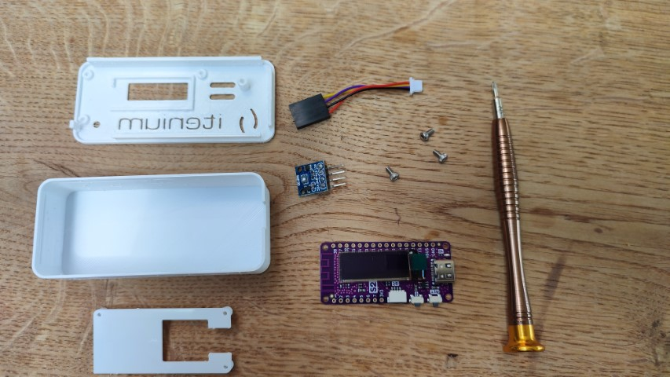
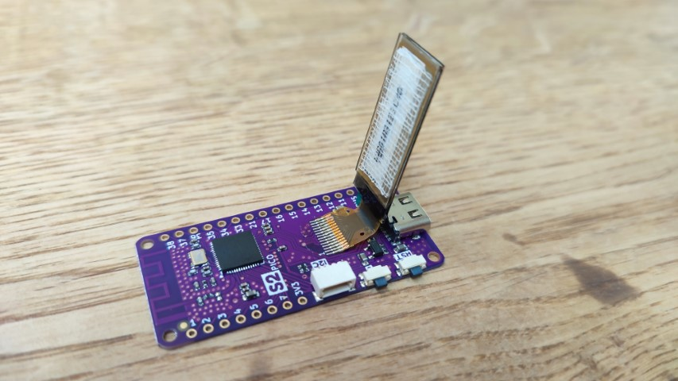
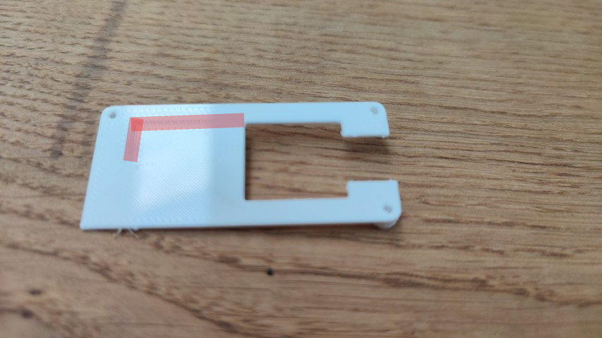
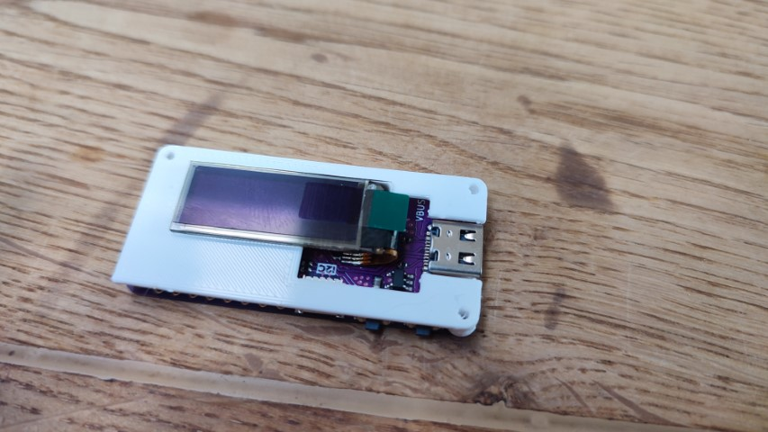
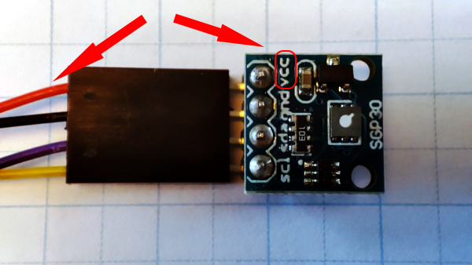
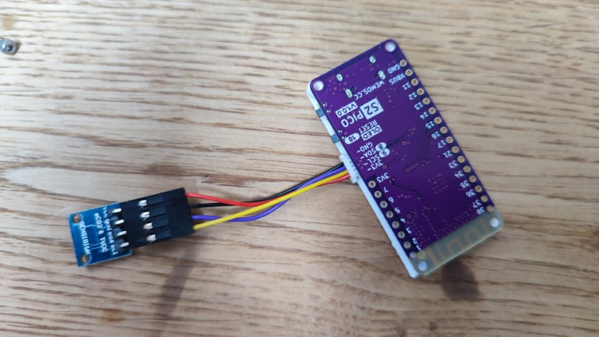
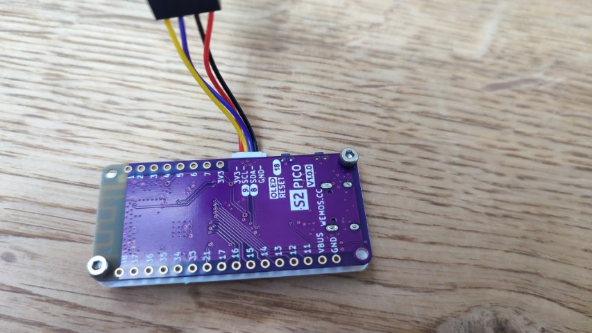
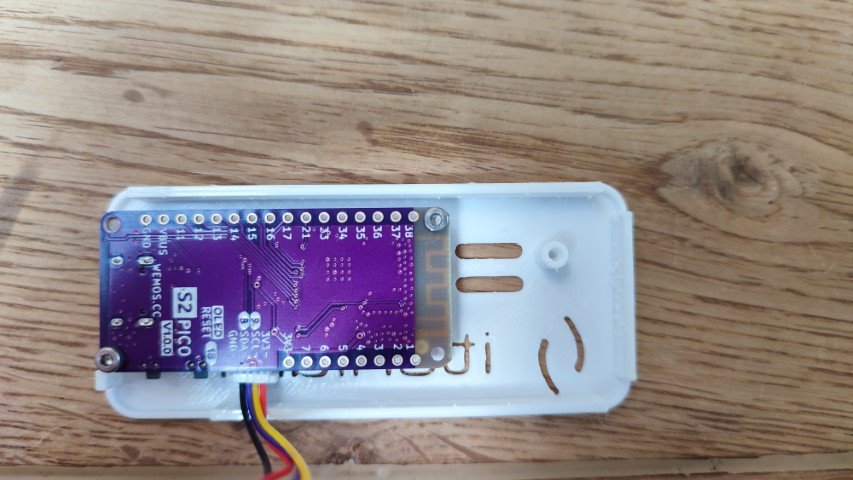
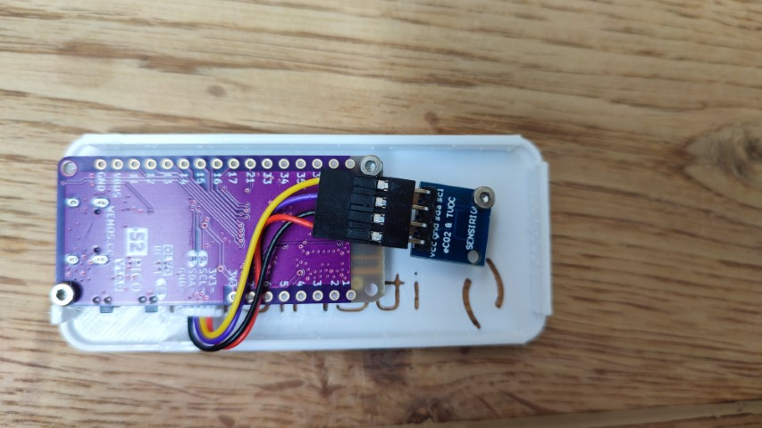
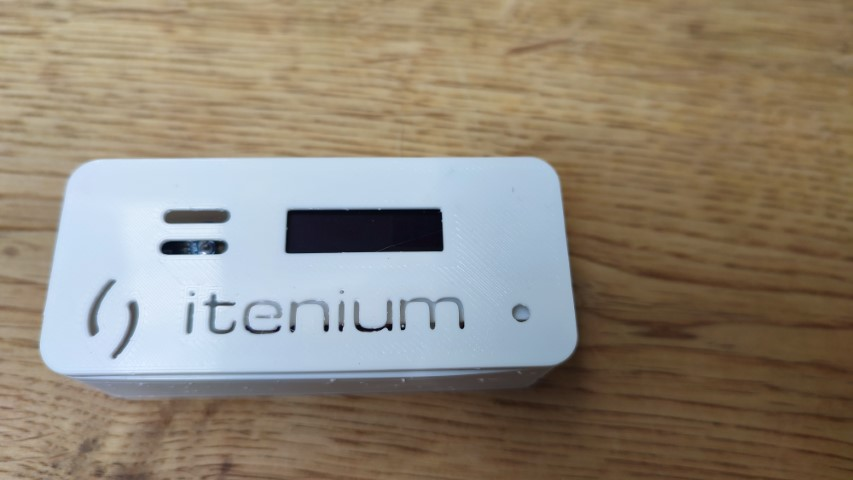

# How to assemble the CO2 meter

## Gather materials

Gather the required materials and components, you'll need:

- Wemos S2 Pico board
- SGP30 Sensor
- Connecting cable
- Enclosure (3 parts)
- 3 screws
- Screwdriver

## Release OLED from board

Slowly peel up the OLED display from the board, taking care to leave the adhesive material on the OLED, not the board.

## Paste OLED on board spacer

First, notice the small indentation on the spacer, this is where you'll align the screen. Marked in red in the next picture.

Next align the OLED with the spacer and press it down. Don't forget to remove the OLED plastic cover after this step. (I sure didn't, ahum)

## Connect the sensor to the board

Next we'll connect the sensor to the board. Pay special attention to the sensor connection! The red wire should go to the "VCC" pin on the sensor. See this image.

## Mount the board in the enclosure

Start the screws that go from the board into the spacer part until you can just see the head of the screw coming out.

Align the board and spacer with the front of the enclosure and finish screwing them in.

## Mount the sensor in the enclosure

Align the sensor with the enclosure as seen in this picture and screw it in.

## Snap the enclosure to close it

Final step, take the back of the enclosure and snap it closed! Take some care not to force some of the plastic guiding parts.

All done!
