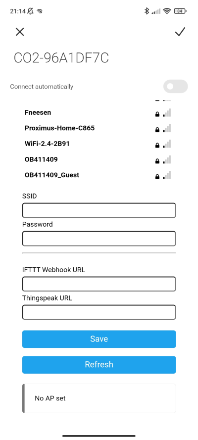

# Configure URL's

We still have two hardcoded URL's in our project, the ThingSpeak URL and the IFTTT URL. In order to make these configurable we'll use parameters in the WiFiManager project. The user can then provide these URL's when they are connecting to their own WiFi. Read the provided [Random Nerd WiFiManager Tutorial](https://randomnerdtutorials.com/wifimanager-with-esp8266-autoconnect-custom-parameter-and-manage-your-ssid-and-password/) to get started!

Set the provided URL's to a global variable and save them using the Preferences library for the next boot! (See the [sensor calibration](sensor-calibration.md) exercise for a refresher).

## Useful links

- [Random Nerd WiFiManager Tutorial](https://randomnerdtutorials.com/wifimanager-with-esp8266-autoconnect-custom-parameter-and-manage-your-ssid-and-password/)
- [Random Nerd Preferences tutorial](https://randomnerdtutorials.com/esp32-save-data-permanently-preferences/)

## Expected result

Everything works? Congratulations! You've built a feature complete CO2 sensor! Give yourself a high five!

Hungry for more? See the [Further improvements](further-improvements.md) exercise where I've provided you with some reading material and ideas to implement some advanced features!
