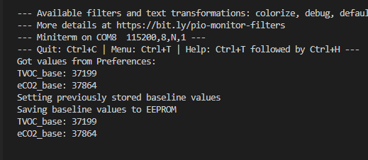

# Sensor calibration

The sensors we use get calibrated in the factory, but to accurately measure CO2 values it needs a baseline. On earth the concentration of CO2 in the outside air is around 400 ppm. So the sensor expects that the lowest value it has read should be around this value (the baseline). You can read this "baseline measurement" from the chip and save it somewhere so the next time you start the sensor you can tell it what its last baseline measurement was. To get the baseline measurement, have a look at the provided example in our SGP30 library.

We'll save this data each minute to some storage on our microcontroller that doesn't get erased when we power cycle the device. We'll use the Preferences library to do this. See the linked tutorial below.

To bring it all together, in your `setup()` function, check if we've got some saved baseline measurements. If so, set these measurements after initializing the sensor.

In the `loop()` function we should check if a minute has passed. If so, get the baseline measurements and save them using the Preferences library.

> **⚠ Note** Not everything will go as planned on the first try, make it a habit to send some debugging data to the `Serial` line to debug your code when it is running on the microcontroller.

## Useful links

- [Random Nerd Preferences tutorial](https://randomnerdtutorials.com/esp32-save-data-permanently-preferences/)
- [Adafruit SGP30 library](https://github.com/adafruit/Adafruit_SGP30)

## Expected result

Everything works? Great! Head on over to the next exercise, [Connect to a known WiFi network](connect-wifi.md)!
