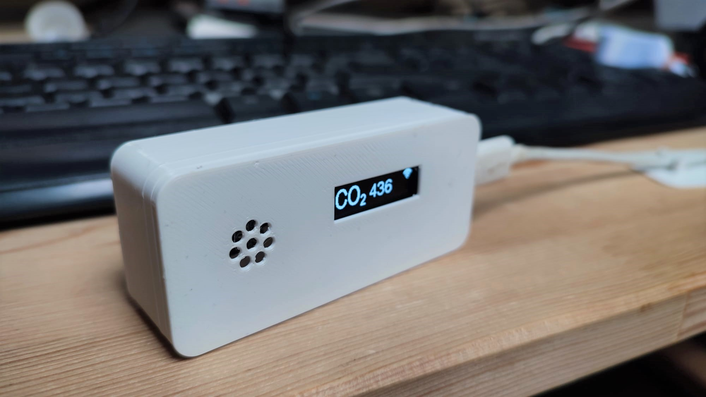

# CO2duino

A DIY CO2 meter based on the [Wemos S2 Pico](https://www.wemos.cc/en/latest/s2/s2_pico.html) dev board and a [SGP30 CO2 sensor](https://www.tinytronics.nl/shop/nl/sensoren/lucht/gas/sgp30-tvoc-en-eco2-sensor-module). It's programmed using [PlatformIO](https://platformio.org/) and the [Arduino](https://www.arduino.cc/) framework.



## Initial hardware setup

To get started you'll have to connect the sensor to your development board with the provided cable. The small white connector plugs in to the development board and the black connector goes to the CO2 sensor.


> **⚠ Note** Pay special attention to the sensor connection! The red wire should go to the "VCC" pin on the sensor. See this image.


Assembly of the board and sensor into the enclosure is described in the [Assembly guide](assembly.md), this is not necessary to get started programming.

## Initial software setup

> **⚠ Note** We use [Visual Studio Code](https://code.visualstudio.com/) for this project, install it first if it isn't already.

First we'll clone this repository:

```sh
git clone https://gitlab.com/michielr/co2duino.git
```

Next we have to install the PlatformIO extension into Visual Studio Code. Go to extensions, search for `PlatformIO` and press install. The initial install takes some time, you'll get notified after about 2 minutes to reload your VS Code window.

After VS Code has reloaded you should see an icon of a house in the bottom of your VS Code window:


Click on this icon and you'll be greeted by the PlatformIO Home screen. On this screen select 'Open Project' and navigate to your cloned repository to open it.

After pressing `Open`, PlatformIO will begin installing all the dependencies of the project. This will take another couple of minutes. You'll know when it's done when the clock icon is gone from the PlatformIO tab.


Now connect your device to your computer, open [`src/main.cpp`](https://gitlab.com/michielr/co2duino/-/blob/development/src/main.cpp) and have a first look at the code. (Maybe change some displayed text?)

Now we're going to upload our code to the device for the first time! Open the PlatformIO tab (see above) and click on the "Upload and monitor" task.


A terminal will pop open on the bottom of your screen and PlatformIO will start compiling your code and then upload it to the connected board. If all goes well, you'll see a green `=== SUCCESS ===` message and the device will reboot itself running your code! PlatformIO should also have opened the "Serial monitor", these are messages the device is sending to your computer. It should print `Hello from the Serial connection!` every second.

You're all set to get started with the exercises!

## Exercises

In these exercises we'll build up to a fully functioning CO2 meter, the exercises aren't fleshed out but provide some reading material to get started. As a starting point the program (found in [`src/main.cpp`](https://gitlab.com/michielr/co2duino/-/blob/development/src/main.cpp)) shows a bootscreen and some text on the display.

1. [Initialize the CO2 sensor and read data from it](exercises/initialize-sensor.md)
2. [Display sensor data on the screen](exercises/display-sensor-data.md)
3. [Save the calibration data to the device](exercises/sensor-calibration.md)
4. [Connect to a known WiFi network](exercises/connect-wifi.md)
5. [Set up an access point so the user can choose their WiFi network and enter its password](exercises/access-point.md)
6. [Send a notification to your phone using IFTTT](exercises/send-notification.md)
7. [Log data to ThingSpeak](exercises/log-data.md)
8. [Make it pretty](exercises/make-it-pretty.md)
9. [Configure URLs](exercises/configure-urls.md)
10. [Further improvements](exercises/further-improvements.md)

## Resources

### Enclosure

- [Assembly guide](assembly.md)

### CO2 Sensor (Sensirion SGP30)

- [SGP30 Datasheet](https://sensirion.com/media/documents/984E0DD5/61644B8B/Sensirion_Gas_Sensors_Datasheet_SGP30.pdf)
- [Adafruit SGP30 library](https://github.com/adafruit/Adafruit_SGP30)

### Display

- [Adafruit SSD1306 OLED driver](https://github.com/adafruit/Adafruit_SSD1306)
- [Adafruit Graphics library](https://learn.adafruit.com/adafruit-gfx-graphics-library)

### WiFi connectivity

- [WiFiManager](https://github.com/tzapu/WiFiManager)

### Utility

- [Preferences](https://espressif-docs.readthedocs-hosted.com/projects/arduino-esp32/en/latest/api/preferences.html)

### Tutorials

- [Random Nerd Tutorials](https://randomnerdtutorials.com/)
- [Adafruit Learn](https://learn.adafruit.com/)
- [Savjee tutorials and blog](https://savjee.be/)

## Troubleshooting

### My code won't flash! There is no COM port found!

No worries, we can manually set the device to "Flashing mode" by pressing the two tiny buttons on the side of the board at the same time. Your device will reboot and be ready to flash again. You might have to manually reset the board after flashing by pressing the tiny "Reset" button.


### Upload and monitor asks me for a COM port

PlatformIO might be starting the monitoring task a bit too fast. Try to use the "Upload" task instead of "Upload and monitor" and when you've seen your device reboot open the "Monitor" task.
